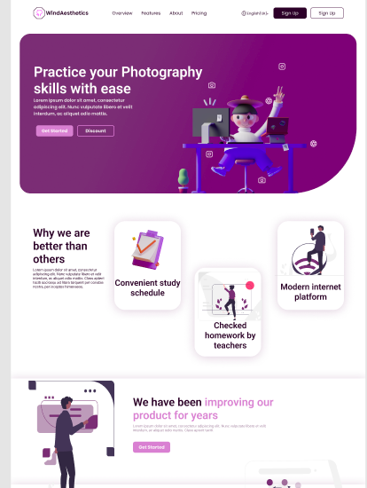

<h1 align="center">WindAesthetics</h1>

  Practice your Photography skills with ease
   
   
  <a href="#">Report a Bug</a>
  ·
  <a href="#">Request a Feature</a>
  .
  <a href="#">Ask a Question</a>

 

## About

WindAesthetics is photography company's landing page website wich has static data. It's shows company's goals and vision. It's includes a feedback form and social media links to company's social accounts.

### Built With
HTML CSS and JavaScript

